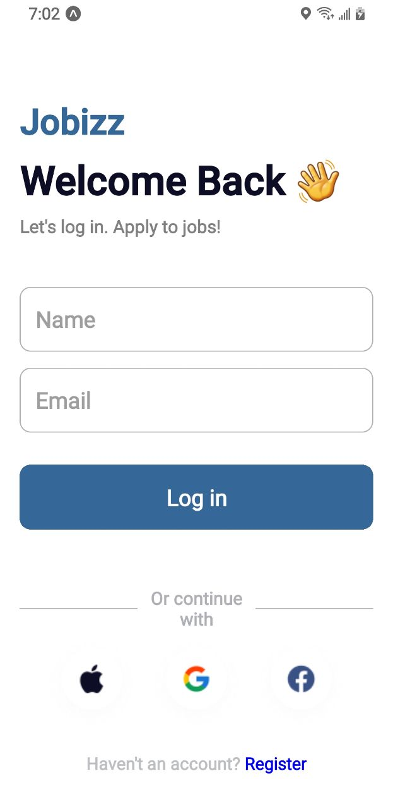

# DCIT202 Assignment 4

## Overview

This assignment involves creating a mobile application using React Native that closely matches a provided UI design. The app will have a login screen where users can input their name and email, which will be passed to a home screen upon login. The home screen will display the provided name and email, and also feature sections for popular and featured job cards.

## Components

### LoginScreen

- **Usage**: To capture user's name and email.
- **Props**: None
- **Functionality**: On submit, navigates to HomeScreen passing name and email as params.

### HomeScreen

- **Usage**: Displays user's name and email, and lists popular and featured job cards.
- **Props**: Receives `name` and `email` via navigation params.
- **Functionality**: Renders `PopularJobCard` and `FeaturedJobCard` components with details.

### PopularJobCard

- **Usage**: Displays details of a popular job.
- **Props**: `title`, `company`, `location`
- **Functionality**: Renders a card with job details.

### FeaturedJobCard

- **Usage**: Displays details of a featured job.
- **Props**: `title`, `company`, `location`
- **Functionality**: Renders a card with job details.

## Screenshots

## Login Screen



<!-- 
_Home Screen_


_Popular Job Card_


_Featured Job Card_ -->

## Running the App

1. Clone the repository to your local machine.
2. Navigate to the project directory:
   ```bash
   cd rn-assignment4-11024002
   ```
3. Install the dependencies:
   ```bash
   npm install
   ```
4. Start the application:
   ```bash
   expo start
   ```
5. Use the Expo CLI to run the app on an iOS simulator, Android emulator, or physical device.
